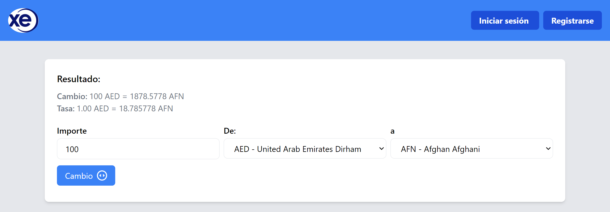

# Prerrequisitos

1. Tener descargardo proyecto https://github.com/wilmer2/currencyconverter_api con sus dependencias
2. Tenerlo ejecutado con `` symfony serve`

# Ejecutar proyecto en dev

1. Clonar repositorio
2. Clonar archivo `.env.example` a `.env`
3. Ejecutar

```
npm run dev
```

# Secciones

## Home



## Login

.png>)

## Registro

.png>)
